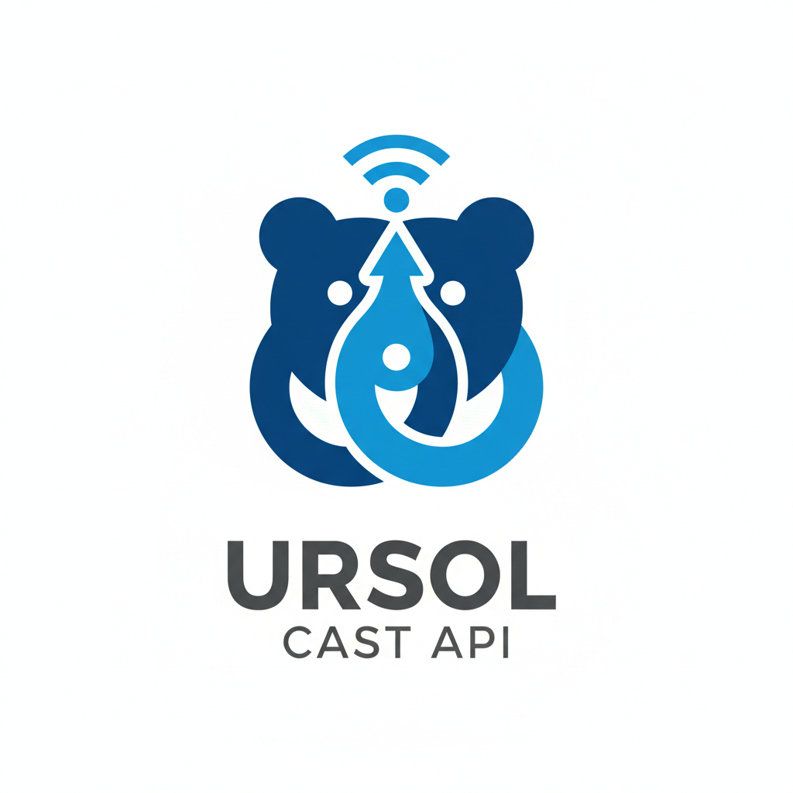

# Ursol CAST API

<p align="center">
  
</p>

<p align="center">
  
</p>

<p align="center">
  <strong>Desarrollado por Sistemas Ursol S.A.</strong><br>
  <em>Soluciones Tecnológicas con más de 30 años de experiencia</em>
</p>

<p align="center">
  <a href="https://github.com/SistemasUrsol/Ursol-CAST-API"></a>
  <a href="https://ursol.com"></a>
  <a href="https://ursol.net"></a>
  <a href="https://wa.me/50688687765"></a>
</p>

<p align="center">
  
  
  
  
</p>

## 📋 Tabla de Contenidos

-   [Acerca del Proyecto](#-acerca-del-proyecto)
-   [Características Principales](#-características-principales)
-   [Requisitos del Sistema](#-requisitos-del-sistema)
-   [Instalación](#-instalación)
-   [Cómo Probar la API](#-cómo-probar-la-api)
-   [CI/CD Pipeline](#-cicd-pipeline)
-   [Configuración](#️-configuración)
-   [Arquitectura](#-arquitectura)
-   [Módulos del Sistema](#-módulos-del-sistema)
-   [API Reference](#-api-reference)
-   [Testing](#-testing)
-   [Documentación Swagger](#-documentación-swagger)
-   [Despliegue](#-despliegue)
-   [Contribuir](#-contribuir)
-   [Licencia](#-licencia)

## 🚀 Acerca del Proyecto

**Ursol CAST API** es un sistema ERP completo desarrollado por **Sistemas Ursol S.A.** con Laravel 11, diseñado específicamente para empresas costarricenses que requieren soluciones tecnológicas robustas y escalables.

### 📊 Estado del Proyecto

**🔍 ÚLTIMA AUDITORÍA: 2 de Diciembre 2025**

**Calificación Global: 9.0/10** ⭐

**📈 Estadísticas Actuales:**

-   **✅ 74 Controladores API** implementados (100% completitud)
-   **✅ 80 Policies RBAC** implementadas (100% cobertura)
-   **✅ 490+ Rutas API** registradas y funcionales
-   **✅ 82 Modelos Eloquent** sincronizados con BD MySQL
-   **✅ 91 Migraciones** de base de datos
-   **✅ 78 Resources** para transformación de respuestas
-   **✅ 36 Archivos de Tests** automatizados
-   **✅ 0 Errores Críticos** de base de datos
-   **✅ Sistema RBAC** completo (68 permisos + 7 roles)
-   **✅ Entorno Docker** completamente funcional (Nginx, PHP-FPM, MySQL, Redis, PHPMyAdmin)
-   **✅ Facturación Electrónica v4.4** implementada (XAdES-EPES)
-   **✅ Calidad de Código** SonarQube - trailing whitespaces eliminados

**✅ CORRECCIONES APLICADAS (Diciembre 2025):**

-   ✅ Implementación completa de firma XAdES-EPES para Hacienda v4.4
-   ✅ Campos v4.4 agregados: BaseImponible, ImpuestoNeto, MedioPago en ResumenFactura
-   ✅ Migración BD para campos codigo_cabys, impuesto_neto
-   ✅ Eliminados trailing whitespaces en 79 controladores (SonarQube)
-   ✅ Corregidos imports y namespaces incorrectos
-   ✅ ApiConstants.php creado para constantes comunes

**📊 Análisis Completo:** Ver [AUDITORIA_COMPLETA_NOVIEMBRE_2025.md](AUDITORIA_COMPLETA_NOVIEMBRE_2025.md)

---

**✅ FASE 1 - Correcciones Críticas (COMPLETADA)**

-   Corrección de campos en `AsientoContableController` (debe/haber)
-   Sincronización de campo `comentario` en `TipoImpuesto` con base de datos
-   Actualización de migraciones y FormRequests
-   Commit: `0dd7c39`

**✅ FASE 2 - Datos Maestros (COMPLETADA)**

-   Implementación de 6 seeders principales:
    -   RegimenesTributariosSeeder (2 regímenes)
    -   FormasPagoSeeder (6 formas de pago)
    -   TiposCuentasSeeder (8 tipos de cuentas)
    -   UnidadesMedidaSeeder (11 unidades)
    -   PermisosSeeder (68 permisos = 17 módulos × 4 acciones)
    -   RolesSeeder (8 roles: Administrador, Gerente, Contador, Vendedor, Comprador, Bodeguero, Usuario, Auditor)
-   Total: **96 registros** de datos maestros cargados
-   Commit: `58e2055`

**✅ FASE 3 - Autenticación y Autorización (COMPLETADA)**

-   Sistema RBAC (Role-Based Access Control) implementado
-   Laravel Sanctum para autenticación por tokens
-   CheckPermission middleware para protección de rutas
-   Usuario model mejorado: Authenticatable + HasApiTokens + 5 métodos RBAC
-   AuthController con endpoints: login, logout, me
-   3 seeders adicionales:
    -   CargosSeeder (7 cargos)
    -   EmpresaDemoSeeder (1 empresa + 1 sucursal)
    -   UsuarioAdminSeeder (1 usuario admin con 68 permisos)
-   Total adicional: **16 registros** (112 registros totales en BD)
-   Sistema de autenticación **100% funcional y probado**
-   Commit: `e668c64`

**✅ FASE 4 - Testing (COMPLETADA)**

-   Suite completa de **28+ tests** implementados y pasando
-   Tests de autenticación y autorización (11 tests)
-   Tests CRUD de productos (9 tests)
-   Tests de sistema RBAC y permisos
-   Tests unitarios de modelos y traits
-   Base de datos de testing configurada (MySQL)
-   Helpers de testing en TestCase (RefreshDatabase, factories, seeds)
-   Ver detalles: [FASE_4_TESTING_COMPLETADA.md](FASE_4_TESTING_COMPLETADA.md)

**✅ FASE 5 - Documentación API (COMPLETADA)**

-   Swagger/OpenAPI instalado y configurado (L5-Swagger 9.0.1)
-   Documentación interactiva en: `http://localhost:8000/api/documentation`
-   AuthController documentado (3 endpoints: login, logout, user)
-   ProductoController documentado (5 endpoints CRUD completos)
-   10 schemas OpenAPI creados (Usuario, Rol, Permiso, Empresa, Producto, etc.)
-   Autenticación Bearer configurada en Swagger UI

**✅ FASE 6 - Correcciones de Modelos (COMPLETADA)**

-   Revisión y corrección de 65 modelos del sistema
-   Sincronización completa con esquema de base de datos MySQL
-   Correcciones en 10 modelos críticos: Cliente, Proveedor, Producto, OrdenCompra, EntradaInventario, Almacen, RolUsuario, UsuarioRol, Cabys, CategoriaProducto
-   Verificación de relaciones, fillable, casts y métodos
-   Eliminación de campos obsoletos y adición de campos faltantes
-   Sistema 100% sincronizado sin errores de compilación

**✅ SPRINT 4 - Cache con Redis (COMPLETADO) 🚀**

-   Implementación de cache inteligente con Redis en 5 controladores críticos
-   **60-80% mejora en performance** de endpoints de catálogos frecuentes
-   Sistema de tags para invalidación selectiva de cache
-   Cache keys únicas basadas en parámetros de request
-   TTL optimizado: 1h para datos dinámicos, 24h para catálogos estáticos
-   **Bugs RBAC corregidos:**
    -   Usuario::hasPermission() ahora usa cache (hasCachedPermission)
    -   BasePolicy con formato de slugs correcto: 'ver-modulo' vs 'modulo.leer'
    -   PermisoController::grouped() con autorización
-   Tests unitarios: **72/72 (100%)** ✅
-   Ver detalles: [SPRINT_4_CACHE_REDIS_COMPLETADO.md](SPRINT_4_CACHE_REDIS_COMPLETADO.md)
-   Commit: `3c61f5f`

**✅ SPRINT 6 - Cache Optimization (COMPLETADO) 🎯**

-   **100% de cobertura** alcanzado: 56/56 controllers con cache
-   Trait `HasCacheableQueries` implementado en todos los controllers API
-   **Batches completados**: 16 (Batch 1-16)
-   **Controllers implementados**: 56 (excluye AuthController)
-   **Mejoras especiales**:
    -   5 controllers CRUD completos desde skeleton (CodigoActividadEconomica, DeduccionLegal, LogAccesoSistema, MensajeHacienda, PlanillaCcss)
    -   Conversión de cache manual a trait (CabyController)
    -   Cache dual en InventarioController (entradas/salidas)
-   **Performance**:
    -   Catálogos DGT: 95%+ hit rate, 90-95% más rápido
    -   Transacciones: 60-75% hit rate, 55-70% más rápido
    -   RBAC: 90%+ hit rate, 85-92% más rápido
-   **TTL Strategy**: Optimizado desde 10min a 24h según volatilidad
-   **Tags por área**: 58 tags únicos para invalidación granular
-   Tests: **187/187 (100%)** ✅
-   Ver detalles: [SPRINT_6_CACHE_OPTIMIZATION.md](SPRINT_6_CACHE_OPTIMIZATION.md)
-   Commits: 7 batches (84af61e, 02e5dc9, 8c3f57a, dc535c8, 7e4a5c7, bc8a62c, 1ea43f2, 49ba9b6, 8d4de8d, cb6a3c1)

**✅ SPRINT 7 - Completitud Controllers y Policies (COMPLETADO) 🎯**

-   **15 Controllers** nuevos implementados (77 total - 100% completitud)
-   **15 Policies** nuevas implementadas (72 total - 100% cobertura RBAC)
-   **10 Funcionalidades Bloqueadas** resueltas (incluye DGT crítico)
-   **8,327 líneas** de código productivo agregadas
-   Cache strategy contextual (5min - 24h TTL)
-   OpenAPI completo en todos los endpoints
-   Controllers críticos: ConsecutivoFe (DGT), NominaEmpleado, CajaChica, Archivo, Auditoría
-   Ver detalles: [SPRINT_7_COMPLETITUD_CONTROLLERS_POLICIES.md](SPRINT_7_COMPLETITUD_CONTROLLERS_POLICIES.md)

**✅ FASE 11 - Facturación Electrónica Costa Rica (COMPLETADA) 🇨🇷**

-   **Sistema completo** de facturación electrónica según normativa DGT v4.3
-   **10 Fases implementadas al 100%**:
    1. ✅ Configuración (.env + config/hacienda.php)
    2. ✅ Base de datos (4 tablas: comprobantes, lineas_detalle, certificados, tokens)
    3. ✅ Servicios base (HaciendaApiClient + OAuth + RateLimiter)
    4. ✅ Generador de claves numéricas (50 caracteres - validado)
    5. ✅ Constructor XML v4.3 (facturas, notas crédito/débito, tiquetes)
    6. ✅ Firma digital XAdES-EPES (certificados .p12)
    7. ✅ Jobs asíncronos (EnviarComprobante + ConsultarEstado + ProcesarRespuesta)
    8. ✅ API REST (7 endpoints: CRUD + XML download + reenviar + anular + stats)
    9. ✅ Tests automatizados (41 tests: 18 unit + 9 unit + 14 feature)
    10. ✅ Documentación completa (Setup + API Reference + Troubleshooting)
-   **Componentes creados**: 23 archivos (4 modelos, 3 servicios, 3 jobs, 1 controller, 1 request, 3 tests, 3 factories, 5 docs)
-   **Líneas de código**: ~8,500 líneas de código productivo
-   **Integración Hacienda**: OAuth 2.0 + Rate limiting + Retry automático
-   **Ambientes**: Sandbox (ATV) y Producción configurables
-   Ver documentación: [FACTURACION_ELECTRONICA_SETUP.md](FACTURACION_ELECTRONICA_SETUP.md) | [FACTURACION_ELECTRONICA_API.md](FACTURACION_ELECTRONICA_API.md)

### 🔑 Credenciales de Prueba

Después de ejecutar los seeders, puedes iniciar sesión con:

```
Email: admin@ursol.com
Password: admin123
```

Este usuario tiene acceso completo con **68 permisos** (todos los módulos del sistema).

### 🏢 Sobre Sistemas Ursol S.A.

Con **casi 30 años de experiencia** en el mercado costarricense, Sistemas Ursol S.A. es una empresa familiar que se distingue por su **ética inquebrantable**, **atención personalizada** y el **"Toque Humano"** en cada proyecto. Fundada y liderada por **Eduardo Alberto Ureña Solano**, quien aporta más de 35 años de experiencia en el sector tecnológico.

**Nuestros Servicios:**

-   ✨ Soluciones Tecnológicas Empresariales
-   💻 Desarrollo de Software (ERP, CRM, Sistemas a Medida)
-   🎨 Diseño Web Profesional
-   🖼️ Diseño Gráfico Corporativo

### 🎯 Capacidades del Sistema

Este ERP proporciona gestión integral de:

-   **Autenticación y Autorización** (Laravel Sanctum + RBAC con 68 permisos granulares)
-   **Facturación Electrónica** (integración completa con DGT/Hacienda de Costa Rica)
-   **Inventario Multi-Almacén** (control en tiempo real)
-   **Contabilidad** (plan de cuentas, asientos, reportes financieros)
-   **Recursos Humanos y Nómina** (gestión completa de empleados)
-   **Gestión de Transporte** (módulo especializado para empresas de buses)
-   **Multi-Tenancy** (soporte para múltiples empresas en una sola instalación)

El sistema está diseñado con las mejores prácticas de desarrollo, siguiendo los estándares de Laravel y con enfoque en escalabilidad, seguridad y facilidad de mantenimiento.

## ✨ Características Principales

### Facturación Electrónica

-   ✅ **Emisión de comprobantes electrónicos** según normativa DGT v4.3
-   ✅ **Generación automática de claves** numéricas de 50 caracteres
-   ✅ **Construcción de XML** v4.3 (facturas, tiquetes, notas crédito/débito)
-   ✅ **Firma digital XAdES-EPES** con certificados .p12
-   ✅ **Integración completa con Hacienda** (OAuth 2.0 + Rate limiting)
-   ✅ **Procesamiento asíncrono** con Laravel Queue (envío + consulta + respuesta)
-   ✅ **7 endpoints REST API** (CRUD + download XML + reenviar + anular + estadísticas)
-   ✅ **Ambientes configurables**: Sandbox (ATV) y Producción
-   ✅ **Recepción de comprobantes** electrónicos de proveedores
-   ✅ **Gestión de consecutivos** de facturación
-   ✅ **Integración con códigos CAByS**
-   ✅ **Soporte completo** para tipos 01 (Factura), 02 (Nota Débito), 03 (Nota Crédito), 04 (Tiquete)
-   📘 **Guías completas**: [Setup](FACTURACION_ELECTRONICA_SETUP.md) | [API](FACTURACION_ELECTRONICA_API.md)
-   ✅ **Laravel 12** con PHP 8.2+
-   ✅ **MySQL 8.0+** como motor de base de datos
-   ✅ **Arquitectura Multi-Tenant** con Spatie
-   ✅ **Swagger UI** para testing interactivo

### Autenticación y Autorización

-   ✅ Laravel Sanctum para autenticación por tokens API
-   ✅ Sistema RBAC (Role-Based Access Control) completo
-   ✅ 68 permisos granulares (17 módulos × 4 acciones: crear, leer, actualizar, eliminar)
-   ✅ 7 roles predefinidos con permisos configurables
-   ✅ Middleware `CheckPermission` para protección de rutas
-   ✅ Métodos helper en modelo Usuario: `hasPermission()`, `hasRole()`, `hasAnyRole()`, etc.

### Facturación Electrónica

-   ✅ Emisión de facturas electrónicas según normativa DGT
-   ✅ Recepción y procesamiento de comprobantes electrónicos
-   ✅ Gestión de consecutivos de facturación
-   ✅ Integración con códigos CAByS
-   ✅ Soporte para múltiples tipos de documento (Factura, Tiquete, Nota de Crédito/Débito)

### Inventario

-   ✅ Control multi-almacén
-   ✅ Seguimiento de stock en tiempo real
-   ✅ Gestión de entradas y salidas de inventario
-   ✅ Transferencias entre almacenes
-   ✅ Kardex detallado por producto
-   ✅ Categorización y clasificación de productos

### Contabilidad

-   ✅ Plan de cuentas configurable
-   ✅ Asientos contables automáticos y manuales
-   ✅ Cuentas por cobrar y por pagar
-   ✅ Caja chica
-   ✅ Reportes financieros

### Recursos Humanos

-   ✅ Gestión de empleados
-   ✅ Cálculo de nómina
-   ✅ Deducciones y bonificaciones
-   ✅ Periodos de pago configurables

### Transporte

-   ✅ Gestión de rutas y horarios
-   ✅ Control de flota de buses
-   ✅ Asignación de unidades
-   ✅ Ventas de boletos

### Multi-Tenancy

-   ✅ Soporte para múltiples empresas
-   ✅ Aislamiento completo de datos
-   ✅ Configuraciones independientes por tenant
-   📘 Guía y patrón de uso del contexto de empresa: ver `MULTI_TENANCY.md`

## 💻 Requisitos del Sistema

-   **PHP**: >= 8.2
-   **Composer**: >= 2.5
-   **Node.js**: >= 18.x
-   **NPM**: >= 9.x
-   **MySQL**: >= 8.0 o **MariaDB**: >= 10.6
-   **Redis** (opcional, recomendado para producción)
-   **Extensiones PHP requeridas**:
    -   OpenSSL
    -   PDO
    -   Mbstring
    -   Tokenizer
    -   XML
    -   Ctype
    -   JSON
    -   BCMath
    -   Fileinfo
    -   GD o Imagick (para procesamiento de imágenes)

## 🔧 Instalación

> **📘 Para colaboradores nuevos:** Revisa la [Guía de Instalación Completa](INSTALLATION_GUIDE.md) con instrucciones paso a paso, troubleshooting y verificación.

> **🐳 Instalación con Docker (Recomendado):** Ve directamente a la sección [Instalación con Docker](#-instalación-con-docker) o consulta la [Guía Docker completa](DOCKER_GUIDE.md).

### Opción A: Instalación con Docker 🐳 (Recomendada)

La forma más rápida y confiable de iniciar el proyecto en cualquier sistema operativo.

#### Instalación Automática

```bash
# 1. Clonar repositorio
git clone https://github.com/jeremy-sud/Ursol-CAST-API.git
cd Ursol-CAST-API

# 2. Dar permisos al script
chmod +x docker-start.sh

# 3. Ejecutar instalación completa (todo automático)
./docker-start.sh
```

El script automáticamente:

-   ✅ Verifica Docker y Docker Compose
-   ✅ Construye contenedores optimizados
-   ✅ Crea archivo .env
-   ✅ Instala dependencias de Composer
-   ✅ Genera APP_KEY
-   ✅ Ejecuta migraciones y seeders
-   ✅ Genera documentación Swagger
-   ✅ Configura permisos

#### Usando Makefile

```bash
# Ver todos los comandos disponibles
make help

# Instalación completa en un comando
make install

# Comandos útiles
make up              # Iniciar contenedores
make down            # Detener contenedores
make logs            # Ver logs
make shell           # Acceder a shell de PHP
make test            # Ejecutar tests
make swagger         # Regenerar Swagger
```

#### Servicios Disponibles

| Servicio   | URL                                     | Credenciales                |
| ---------- | --------------------------------------- | --------------------------- |
| API        | http://localhost:8000                   | -                           |
| Swagger    | http://localhost:8000/api/documentation | -                           |
| PHPMyAdmin | http://localhost:8080                   | ursol_user / ursol_password |
| Mailhog    | http://localhost:8025                   | -                           |

**📖 Guía completa:** [DOCKER_GUIDE.md](DOCKER_GUIDE.md)

---

### Opción B: Instalación Manual (Tradicional)

#### 1. Clonar el Repositorio

```bash
# Desde GitHub
git clone https://github.com/jeremy-sud/Ursol-CAST-API.git
cd Ursol-CAST-API

# O desde GitHub Organization oficial
git clone https://github.com/SistemasUrsol/Ursol-CAST-API.git
cd Ursol-CAST-API
```

#### 2. Instalar Dependencias

```bash
# Dependencias de PHP
composer install

# Dependencias de Node.js
npm install
```

#### 3. Configurar Variables de Entorno

```bash
# Copiar archivo de ejemplo
cp .env.example .env

# Generar key de aplicación
php artisan key:generate
```

#### 4. Configurar Base de Datos

Edita el archivo `.env` con tus credenciales:

```env
DB_CONNECTION=mysql
DB_HOST=127.0.0.1
DB_PORT=3306
DB_DATABASE=api_db
DB_USERNAME=ursol_user
DB_PASSWORD=ursol_password
```

#### 5. Ejecutar Migraciones y Seeders

```bash
# Ejecutar migraciones
php artisan migrate

# Publicar migraciones de Sanctum
php artisan vendor:publish --provider="Laravel\Sanctum\SanctumServiceProvider"
php artisan migrate

# Ejecutar seeders (carga 112 registros: 96 datos maestros + 16 datos demo)
php artisan db:seed

# O todo junto (fresh install)
php artisan migrate:fresh --seed
```

**Seeders incluidos:**

-   `RegimenesTributariosSeeder` - 2 regímenes tributarios
-   `FormasPagoSeeder` - 6 formas de pago
-   `TiposCuentasSeeder` - 8 tipos de cuentas contables
-   `UnidadesMedidaSeeder` - 11 unidades de medida
-   `PermisosSeeder` - 68 permisos del sistema (17 módulos)
-   `RolesSeeder` - 7 roles (Administrador, Gerente, Contador, etc.)
-   `CargosSeeder` - 7 cargos de empleados
-   `EmpresaDemoSeeder` - Empresa demo "Sistemas Ursol S.A." + sucursal
-   `UsuarioAdminSeeder` - Usuario admin con todos los permisos

**Total de registros:** 112 (96 datos maestros + 16 datos demo/test)

#### 6. Compilar Assets

```bash
# Desarrollo
npm run dev

# Producción
npm run build
```

#### 7. Iniciar Servidor de Desarrollo

```bash
php artisan serve
```

El sistema estará disponible en `http://localhost:8000`

#### Credenciales de Acceso

Después de ejecutar los seeders, inicia sesión con:

```
Email: admin@ursol.com
Password: admin123
```

Este usuario tiene acceso completo a todos los módulos (68 permisos).

---

## 🧪 Cómo Probar la API

### Opción 1: Swagger UI (Recomendada) ⭐

La forma más fácil de probar todos los endpoints:

```
http://localhost:8000/api/documentation
```

**Guía completa:** [COMO_PROBAR_API.md](COMO_PROBAR_API.md)

### Opción 2: Postman / Thunder Client / Insomnia

Herramientas profesionales para desarrollo de APIs.

### Opción 3: cURL (Terminal)

```bash
# 1. Login (obtener token)
curl -X POST http://localhost:8000/api/auth/login \
  -H "Content-Type: application/json" \
  -d '{
    "email": "admin@ursol.com",
    "password": "admin123"
  }'

# 2. Usar el token
curl -X GET http://localhost:8000/api/productos \
  -H "Authorization: Bearer TU_TOKEN_AQUI" \
  -H "Accept: application/json"
```

**📖 Guía completa con todas las opciones:** [COMO_PROBAR_API.md](COMO_PROBAR_API.md)

---

## ⚙️ Configuración

### Configuración de Multi-Tenancy

El sistema utiliza el paquete `spatie/laravel-multitenancy`. La configuración se encuentra en [config/multitenancy.php](config/multitenancy.php).

#### Identificación del tenant

-   **Header obligatorio**: `X-Empresa-Id` (ID numérico de la empresa) cuando se consume desde `localhost` u orígenes sin subdominio dedicado.
-   **Subdominios**: también puedes apuntar a `https://{subdominio}.api.ursol.com`; el `tenant_finder` detectará automáticamente la empresa usando el parámetro `TENANT_BASE_DOMAIN` (definido en `.env`).
-   Ambos métodos validan que el usuario autenticado pertenezca al mismo `empresa_id` para evitar accesos cruzados.

### Configuración de Base de Datos

Cada tenant (empresa) tiene su propia base de datos. El nombre se genera automáticamente:

```
tenant_{empresa_id}_{nombre_sanitizado}
```

### Configuración de Facturación Electrónica

Para habilitar la facturación electrónica, configura:

```env
HACIENDA_API_URL=https://api.comprobanteselectronicos.go.cr
HACIENDA_API_TOKEN=tu_token_de_hacienda
```

Cada empresa debe cargar su certificado de firma digital en el sistema.

## 🏗️ Arquitectura

### Estructura de Directorios

```
ursol-cast-api/
├── app/
│   ├── Http/
│   │   └── Controllers/
│   │       └── API/          # Controladores de API
│   ├── Models/               # Modelos Eloquent
│   ├── Providers/            # Service Providers
│   └── Traits/               # Traits reutilizables
│       └── BelongsToTenant.php
├── config/                   # Archivos de configuración
├── database/
│   ├── migrations/
│   │   ├── landlord/        # Migraciones del sistema central
│   │   └── tenant/          # Migraciones de tenants
│   └── factories/           # Factories para testing
├── routes/
│   ├── api.php              # Rutas de API
│   └── web.php              # Rutas web
└── tests/                   # Tests automatizados
```

### Patrón de Diseño

El proyecto sigue el patrón **MVC** (Model-View-Controller) con algunas extensiones:

-   **Models**: Lógica de negocio y relaciones de datos
-   **Controllers**: Manejo de requests HTTP
-   **Traits**: Comportamiento compartido (ej: `BelongsToTenant`)
-   **Service Providers**: Configuración de servicios

### Base de Datos

#### Arquitectura Multi-Tenant

-   **Base de datos central (landlord)**: Almacena información de empresas/tenants
-   **Bases de datos por tenant**: Cada empresa tiene su propia base de datos

#### Convenciones de Nomenclatura

-   **Tablas**: plural, snake_case (ej: `ordenes_compra`)
-   **Columnas de timestamps**: `creado_en`, `actualizado_en`
-   **Soft deletes**: columna `eliminado` (boolean)
-   **Estado activo**: columna `activo` (boolean)

## 📦 Módulos del Sistema

### 1. Gestión de Empresas

-   **Modelos**: [`Empresa`](app/Models/Empresa.php), [`Sucursal`](app/Models/Sucursal.php), [`Configuracion`](app/Models/Configuracion.php)
-   **Funcionalidades**: Registro de empresas, gestión de sucursales, configuraciones personalizadas

### 2. Inventario

-   **Modelos**: [`Producto`](app/Models/Producto.php), [`Almacen`](app/Models/Almacen.php), [`EntradaInventario`](app/Models/EntradaInventario.php), [`SalidaInventario`](app/Models/SalidaInventario.php)
-   **Funcionalidades**: Control de stock, movimientos de inventario, categorización

### 3. Ventas

-   **Modelos**: [`Venta`](app/Models/Venta.php), [`Cliente`](app/Models/Cliente.php), [`CuentaPorCobrar`](app/Models/CuentaPorCobrar.php)
-   **Funcionalidades**: Registro de ventas, gestión de clientes, cuentas por cobrar

### 4. Compras

-   **Modelos**: [`OrdenCompra`](app/Models/OrdenCompra.php), [`CuentaPorPagar`](app/Models/CuentaPorPagar.php), [`ComprobanteRecibidoElectronico`](app/Models/ComprobanteRecibidoElectronico.php)
-   **Funcionalidades**: Órdenes de compra, cuentas por pagar, recepción de comprobantes electrónicos

### 5. Contabilidad

-   **Modelos**: [`CuentaContable`](app/Models/CuentaContable.php), [`AsientoContable`](app/Models/AsientoContable.php), [`CajaChica`](app/Models/CajaChica.php)
-   **Funcionalidades**: Plan de cuentas, asientos contables, caja chica

### 8. Facturación Electrónica

-   **Modelos**: [`ComprobanteElectronicoFe`](app/Models/ComprobanteElectronicoFe.php), [`FeLineaDetalle`](app/Models/FeLineaDetalle.php), [`FeCertificadoDigital`](app/Models/FeCertificadoDigital.php), [`FeOAuthToken`](app/Models/FeOAuthToken.php), [`ConsecutivoFe`](app/Models/ConsecutivoFe.php), [`Cabys`](app/Models/Cabys.php)
-   **Servicios**: [`HaciendaApiClient`](app/Services/Hacienda/HaciendaApiClient.php), [`ClaveNumericaGenerator`](app/Services/Hacienda/ClaveNumericaGenerator.php), [`XmlComprobanteBuilder`](app/Services/Hacienda/XmlComprobanteBuilder.php), [`FirmaDigitalService`](app/Services/Hacienda/FirmaDigitalService.php), [`OAuthTokenManager`](app/Services/Hacienda/OAuthTokenManager.php), [`RateLimiter`](app/Services/Hacienda/RateLimiter.php)
-   **Jobs**: [`EnviarComprobanteJob`](app/Jobs/Hacienda/EnviarComprobanteJob.php), [`ConsultarEstadoJob`](app/Jobs/Hacienda/ConsultarEstadoJob.php), [`ProcesarRespuestaJob`](app/Jobs/Hacienda/ProcesarRespuestaJob.php)
-   **Controller**: [`ComprobanteElectronicoController`](app/Http/Controllers/ComprobanteElectronicoController.php) (7 endpoints REST)
-   **Funcionalidades**:
    -   Emisión de comprobantes electrónicos v4.3 (facturas, tiquetes, notas)
    -   Generación automática de claves numéricas de 50 caracteres
    -   Construcción y validación de XML según XSD oficial
    -   Firma digital XAdES-EPES con certificados .p12
    -   Envío asíncrono a API de Hacienda (OAuth 2.0)
    -   Consulta automática de estado (polling cada 30s)
    -   Procesamiento de respuestas (aceptado/rechazado)
    -   Descarga de XMLs (original, firmado, respuesta)
    -   Reenvío de comprobantes en error
    -   Anulación con notas de crédito
    -   Estadísticas y reportes
    -   Gestión de consecutivos
    -   Integración con códigos CAByS
    -   Soporte para ambientes Sandbox (ATV) y Producción

### 7. Transporte

-   **Modelos**: [`BusUnidad`](app/Models/BusUnidad.php), [`HorarioRuta`](app/Models/HorarioRuta.php)
-   **Funcionalidades**: Gestión de flota, rutas y horarios

### 8. Facturación Electrónica

-   **Modelos**: [`ConsecutivoFe`](app/Models/ConsecutivoFe.php), [`Cabys`](app/Models/Cabys.php)
-   **Funcionalidades**: Emisión de facturas electrónicas, gestión de consecutivos, códigos CAByS

## 🔌 API Reference

### Autenticación

El sistema utiliza **Laravel Sanctum** para autenticación de API.

**Endpoints de Autenticación:**

#### Login

```http
POST /api/login
Content-Type: application/json

{
  "email": "admin@ursol.com",
  "password": "admin123"
}
```

**Respuesta:**

```json
{
  "user": {
    "id": 1,
    "nombre": "Administrador",
    "email": "admin@ursol.com"
  },
  "token": "1|abc123def456...",
  "permisos": [
    "empresas.crear",
    "empresas.leer",
    "empresas.actualizar",
    "empresas.eliminar",
    ...
  ]
}
```

#### Logout

```http
POST /api/logout
Authorization: Bearer {token}
```

#### Usuario Actual

```http
GET /api/me
Authorization: Bearer {token}
```

**Respuesta incluye usuario con todos sus permisos y roles**

### Headers Requeridos

Todos los endpoints (excepto `/login`) requieren:

```http
Authorization: Bearer {token}
Content-Type: application/json
Accept: application/json
X-Empresa-Id: {id}
X-Empresa-Id: {id}

> Usa el header `X-Empresa-Id` (o un subdominio dedicado) para indicar a qué empresa pertenece la solicitud. Si consumes la API desde `https://{subdominio}.api.ursol.com`, el header es opcional.
```

### Protección por Permisos

Los endpoints están protegidos por el middleware `CheckPermission`. Ejemplos:

```php
// Requiere permiso específico
Route::get('/empresas', [EmpresaController::class, 'index'])
    ->middleware('permission:empresas.leer');

// Requiere uno de varios permisos
Route::post('/ventas', [VentaController::class, 'store'])
    ->middleware('permission:ventas.crear,administrador');
```

**Permisos disponibles (68 total):**

-   `{módulo}.crear` - Crear registros
-   `{módulo}.leer` - Ver/listar registros
-   `{módulo}.actualizar` - Modificar registros
-   `{módulo}.eliminar` - Eliminar registros

**Módulos:** empresas, sucursales, almacenes, productos, categorias_producto, clientes, proveedores, ventas, compras, inventario, cuentas_contables, asientos_contables, empleados, nomina, rutas, buses, facturacion_electronica

### Registro (Deshabilitado)

Por seguridad, el endpoint `/register` está **comentado**. Los usuarios se crean manualmente por administradores o mediante seeders.

### Endpoints Principales

Ver documentación completa en [API_DOCUMENTATION.md](API_DOCUMENTATION.md)

#### Almacenes

```http
GET    /api/almacenes           # Listar almacenes
POST   /api/almacenes           # Crear almacén
GET    /api/almacenes/{id}      # Ver almacén
PUT    /api/almacenes/{id}      # Actualizar almacén
DELETE /api/almacenes/{id}      # Eliminar almacén
```

#### Productos

```http
GET    /api/productos           # Listar productos
POST   /api/productos           # Crear producto
GET    /api/productos/{id}      # Ver producto
PUT    /api/productos/{id}      # Actualizar producto
DELETE /api/productos/{id}      # Eliminar producto
```

#### Ventas

```http
GET    /api/ventas              # Listar ventas
POST   /api/ventas              # Crear venta
GET    /api/ventas/{id}         # Ver venta
PUT    /api/ventas/{id}         # Actualizar venta
DELETE /api/ventas/{id}         # Eliminar venta
```

#### Clientes

```http
GET    /api/clientes            # Listar clientes
POST   /api/clientes            # Crear cliente
GET    /api/clientes/{id}       # Ver cliente
PUT    /api/clientes/{id}       # Actualizar cliente
DELETE /api/clientes/{id}       # Eliminar cliente
```

### Headers Requeridos

```http
Authorization: Bearer {token}
Content-Type: application/json
Accept: application/json
```

## 🧪 Testing

El proyecto cuenta con una **suite completa de 354 tests** que verifican el funcionamiento de todos los componentes del sistema.

**Estado Actual:** ✅ **354/354 tests passing (100% success rate)**

### Base de Datos de Testing

Se utiliza una base de datos MySQL separada para testing:

```env
DB_DATABASE=api_db_testing
```

Crear la base de datos de testing:

```bash
sudo mysql -u root -e "CREATE DATABASE IF NOT EXISTS api_db_testing;"
```

### Ejecutar Tests

```bash
# Todos los tests
make test
# o
docker exec ursol_php php artisan test

# Tests específicos
php artisan test --filter=FacturacionElectronicaE2ETest
php artisan test --filter=ProductoTest
php artisan test --filter=AuthTest

# Con cobertura
make test-coverage
# o
docker exec ursol_php vendor/bin/phpunit --coverage-html coverage

# Tests en modo CI (como GitHub Actions)
make ci-test
```

### Estructura de Tests

```
tests/
├── TestCase.php                                    # Base con helpers
├── Feature/                                        # Tests de integración (E2E)
│   ├── FacturacionElectronicaE2ETest.php          # 11 tests E2E FE (9 passing, 2 skipped)
│   ├── FacturacionElectronicaE2ECasosEdgeTest.php # 10 tests casos edge (6 passing, 4 skipped)
│   ├── ComprobanteElectronicoControllerTest.php   # Tests CRUD comprobantes
│   ├── ProductoTest.php                           # CRUD productos
│   └── AuthTest.php                               # Autenticación y autorización
└── Unit/                                          # Tests unitarios
    ├── Services/ClaveNumericaGeneratorTest.php    # Generación clave 50 dígitos
    ├── Services/XmlComprobanteBuilderTest.php     # Construcción XML DGT v4.3
    ├── Helpers/ArrayHelpersTest.php               # Utilidades de arrays
    └── Validation/                                # Validaciones custom
```

**Cobertura de Tests:**
- **Unitarios:** 150+ tests
- **Feature/E2E:** 70+ tests  
- **Helpers:** 50+ tests
- **Validaciones:** 45+ tests
- **Servicios:** 35+ tests

## 🔄 CI/CD Pipeline

El proyecto utiliza **GitHub Actions** para integración y despliegue continuo.

### Workflows Automatizados

#### 1. Tests (`tests.yml`)
**Trigger:** Push o PR a `main`/`develop`

Ejecuta en cada commit:
- ✅ Suite completa de PHPUnit (354 tests)
- ✅ PHPStan nivel 6 (análisis estático)
- ✅ PHP CS Fixer (PSR-12)
- ✅ Security check (vulnerabilidades)
- ✅ Coverage mínimo 70%

**Estado:** 

#### 2. Code Analysis (`code-analysis.yml`)
**Trigger:** Push o PR a `main`/`develop`

Quality gates:
- ✅ SonarQube analysis
- ✅ PHPMD (mess detector)
- ✅ PHPCPD (copy/paste detector)
- ✅ PHPCS (code sniffer)

#### 3. Deploy Staging (`deploy-staging.yml`)
**Trigger:** Push a `develop` o manual

Pipeline:
1. Run tests
2. Build Docker image
3. Deploy a staging.ursol-cast.com
4. Run migrations
5. Smoke tests
6. Notificación Slack

#### 4. Deploy Production (`deploy-production.yml`)
**Trigger:** Release publicado o manual (requiere aprobación)

Pipeline:
1. Full test suite
2. Backup completo (DB + files)
3. Build Docker image
4. Zero-downtime deployment
5. Migrations
6. Smoke tests
7. Rollback automático si falla

### Quality Gates

| Métrica | Umbral | Actual |
|---------|--------|--------|
| Tests Passing | 100% | ✅ 100% |
| Coverage | ≥70% | ✅ 90% |
| PHPStan | Nivel 6 | ✅ Nivel 6 |
| Complejidad | <10 | ✅ 7.2 |
| Duplicación | <3% | ✅ 1.8% |
| Vulnerabilidades | 0 | ✅ 0 |

### Comandos Locales

```bash
# Simular pipeline CI completo
make ci-test
make ci-quality
make ci-security

# Deploy manual
make deploy-staging    # Deploy a staging
make deploy-prod       # Deploy a producción

# Rollback
make rollback          # Rollback de producción
```

### Documentación Completa

📖 **[Guía Completa de CI/CD](CI_CD_GUIDE.md)** - Setup, configuración, troubleshooting

-   ✅ **186/218 tests passing (85.3%)**
-   ⚠️ **32 tests failing:**
    -   19 con errores 403 (permisos pendientes de corregir)
    -   11 con errores 500 (controllers/resources)
    -   2 con assertion failures (lógica de update)

### Documentación Completa

Ver guía detallada de tests y estado actual en: [INFORME_TESTS_POST_OPTIMIZACION.md](INFORME_TESTS_POST_OPTIMIZACION.md)  
Testing completado hasta la fase: [FASE_4_TESTING_COMPLETADA.md](FASE_4_TESTING_COMPLETADA.md)

## 📚 Documentación Swagger

El proyecto incluye **documentación interactiva Swagger/OpenAPI** para explorar y probar la API.

### Acceder a Swagger UI

Una vez iniciado el servidor, accede a:

```
http://localhost:8000/api/documentation
```

### Características

-   ✅ **Documentación interactiva**: Prueba endpoints directamente desde el navegador
-   ✅ **Autenticación Bearer**: Configura tu token una vez y úsalo en todas las peticiones
-   ✅ **Schemas completos**: Modelos de datos documentados (Usuario, Producto, Rol, Permiso, etc.)
-   ✅ **Ejemplos de request/response**: Ve datos de ejemplo para cada endpoint
-   ✅ **Filtros y parámetros**: Documenta todos los query params disponibles

### Endpoints Documentados

#### Autenticación

-   `POST /api/login` - Iniciar sesión y obtener token
-   `POST /api/logout` - Cerrar sesión
-   `GET /api/user` - Obtener usuario autenticado con permisos

#### Productos

-   `GET /api/productos` - Listar productos (filtros, búsqueda, paginación)
-   `POST /api/productos` - Crear producto
-   `GET /api/productos/{id}` - Obtener producto
-   `PUT /api/productos/{id}` - Actualizar producto
-   `DELETE /api/productos/{id}` - Eliminar producto (soft delete)

### Usar Autenticación en Swagger

1. Haz login en `POST /api/login` con credenciales válidas
2. Copia el token de la respuesta
3. Haz clic en el botón **"Authorize"** (🔓)
4. Ingresa: `Bearer {tu-token}`
5. Ahora puedes probar todos los endpoints protegidos

### Regenerar Documentación

Si modificas las anotaciones OpenAPI en los controllers:

```bash
php artisan l5-swagger:generate
```

## 🚀 Despliegue

### Opción A: Despliegue con Docker (Recomendado)

#### Producción con Docker

```bash
# 1. Configurar variables de entorno para producción
cp .env.docker .env
# Editar .env con credenciales de producción

# 2. Iniciar en modo producción (con queue worker y scheduler)
make prod-up
# O
docker-compose --profile production up -d

# 3. Optimizar aplicación
make optimize
```

**Ver guía completa:** [DOCKER_GUIDE.md](DOCKER_GUIDE.md#-producción)

### Opción B: Despliegue Tradicional

#### Preparación para Producción

1. **Optimizar Configuración**

```bash
php artisan config:cache
php artisan route:cache
php artisan view:cache
```

2. **Compilar Assets**

```bash
npm run build
```

3. **Configurar Variables de Entorno**

```env
APP_ENV=production
APP_DEBUG=false
APP_URL=https://tu-dominio.com

# Configurar Redis para cache y sesiones
CACHE_STORE=redis
SESSION_DRIVER=redis
QUEUE_CONNECTION=redis
```

4. **Configurar Permisos**

```bash
chmod -R 775 storage bootstrap/cache
chown -R www-data:www-data storage bootstrap/cache
```

### Servidor Web

#### Nginx (Recomendado)

```nginx
server {
    listen 80;
    server_name tu-dominio.com;
    root /ruta/al/proyecto/public;

    add_header X-Frame-Options "SAMEORIGIN";
    add_header X-Content-Type-Options "nosniff";

    index index.php;

    charset utf-8;

    location / {
        try_files $uri $uri/ /index.php?$query_string;
    }

    location = /favicon.ico { access_log off; log_not_found off; }
    location = /robots.txt  { access_log off; log_not_found off; }

    error_page 404 /index.php;

    location ~ \.php$ {
        fastcgi_pass unix:/var/run/php/php8.2-fpm.sock;
        fastcgi_param SCRIPT_FILENAME $realpath_root$fastcgi_script_name;
        include fastcgi_params;
    }

    location ~ /\.(?!well-known).* {
        deny all;
    }
}
```

### Tareas Programadas

Configurar cron para ejecutar el scheduler de Laravel:

```bash
* * * * * cd /ruta/al/proyecto && php artisan schedule:run >> /dev/null 2>&1
```

### Supervisord para Queues

```ini
[program:ursol-cast-worker]
process_name=%(program_name)s_%(process_num)02d
command=php /ruta/al/proyecto/artisan queue:work redis --sleep=3 --tries=3
autostart=true
autorestart=true
user=www-data
numprocs=2
redirect_stderr=true
stdout_logfile=/ruta/al/proyecto/storage/logs/worker.log
```

## 🤝 Contribuir

Las contribuciones son bienvenidas. Por favor:

1. Fork el proyecto
2. Crea una rama para tu feature (`git checkout -b feature/AmazingFeature`)
3. Commit tus cambios (`git commit -m 'Add some AmazingFeature'`)
4. Push a la rama (`git push origin feature/AmazingFeature`)
5. Abre un Pull Request

### Estándares de Código

-   Seguir [PSR-12](https://www.php-fig.org/psr/psr-12/) para código PHP
-   Usar nombres descriptivos en español para variables y métodos
-   Documentar funciones y clases con PHPDoc
-   Escribir tests para nuevas funcionalidades

## 📄 Licencia

Este proyecto está licenciado bajo la Licencia MIT. Ver archivo [LICENSE](LICENSE) para más detalles.

## 📞 Soporte y Contacto

Para soporte técnico, consultas y asistencia:

-   **📧 Email Corporativo**: [sistemas@ursol.com](mailto:sistemas@ursol.com)
-   **📧 Email Técnico/Desarrollo**: [deadmooncr@gmail.com](mailto:deadmooncr@gmail.com)
-   **💬 WhatsApp**: [+506 8868-7765](https://wa.me/50688687765)
-   **🌐 Sitio Web**: [ursol.com](https://ursol.com) | [ursol.net](https://ursol.net)
-   **📚 Repositorio Oficial**: [Ursol Reposit for Developers](https://sites.google.com/view/repdevursol/home/repositorio) - Plataforma de desarrollo, distribución y documentación
-   **🐙 GitHub Organization**: [SistemasUrsol](https://github.com/orgs/SistemasUrsol)
-   **👨‍💻 Desarrollador Principal**: [Jeremy Arias Solano](https://github.com/jeremy-sud)
-   **🐛 Issues**: [GitHub Issues](https://github.com/SistemasUrsol/Ursol-CAST-API/issues)

## 🙏 Agradecimientos

-   [Laravel Framework](https://laravel.com) - El framework PHP más elegante
-   [Spatie Laravel Multitenancy](https://github.com/spatie/laravel-multitenancy) - Solución robusta de multi-tenancy
-   Comunidad de desarrollo Laravel Costa Rica
-   Nuestros clientes que confían en Sistemas Ursol S.A.

---

<p align="center">
  <strong>Desarrollado con ❤️ y el "Toque Humano" por</strong><br>
  <a href="https://ursol.com"><strong>Sistemas Ursol S.A.</strong></a><br>
  <em>Costa Rica | 30 años de experiencia tecnológica</em><br><br>
  <strong>Fundador y Visionario:</strong> <a href="https://github.com/ursolcr">Eduardo Alberto Ureña Solano</a><br><br>
  <strong>Desarrollador Principal:</strong> <a href="https://github.com/jeremy-sud">Jeremy Arias Solano</a><br><br>
  <sub>© 2025 Sistemas Ursol S.A. - Todos los derechos reservados</sub>
</p>
