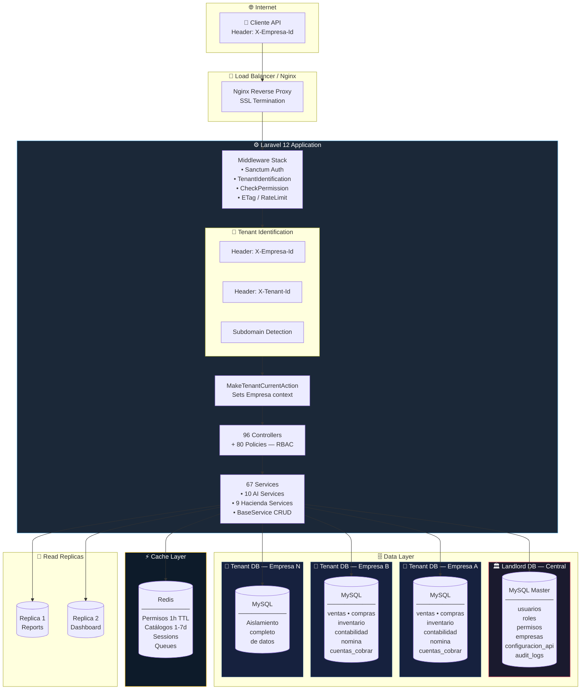

# Arquitectura Multi-Tenant — Ursol CAST API

> Visualización de la separación de datos entre el Landlord (base de datos central) y los Tenants (base de datos por empresa).

## Diagrama de Arquitectura

## Conceptos Clave

| Concepto | Descripción |
|----------|-------------|
| **Landlord DB** | Base de datos compartida: `usuarios`, `roles`, `permisos`, `empresas`, `configuracion_api` |
| **Tenant DB** | Base de datos aislada por empresa: `ventas`, `compras`, `inventario`, `contabilidad`, `nomina` |
| **Identificación** | Vía headers `X-Empresa-Id`, `X-Tenant-Id` o subdominio |
| **BelongsToTenant** | Trait que agrega `where empresa_id = $tenantId` automático a todos los queries |
| **MakeTenantCurrentAction** | Acción de Spatie que establece el contexto del tenant en cada request/job |
| **Queues Tenant-Aware** | Todos los jobs heredan automáticamente el contexto del tenant |

## Tablas por Capa

### 🏛️ Landlord (Compartida)
`usuarios`, `roles`, `permisos`, `roles_permisos`, `empresas`, `configuracion_api`, `audit_logs`, `webhooks`, `webhook_logs`

### 🏢 Tenant (Por Empresa) — 43+ modelos
`ventas`, `detalle_ventas`, `clientes`, `productos`, `compras`, `ordenes_compra`, `inventario_productos`, `almacenes`, `cuentas_contables`, `asientos_contables`, `detalle_asientos`, `empleados`, `nominas`, `cuentas_cobrar`, `cuentas_pagar`, `comprobantes_electronicos_fe`, `rutas`, `horarios_ruta`, `bus_unidades`, y más.
