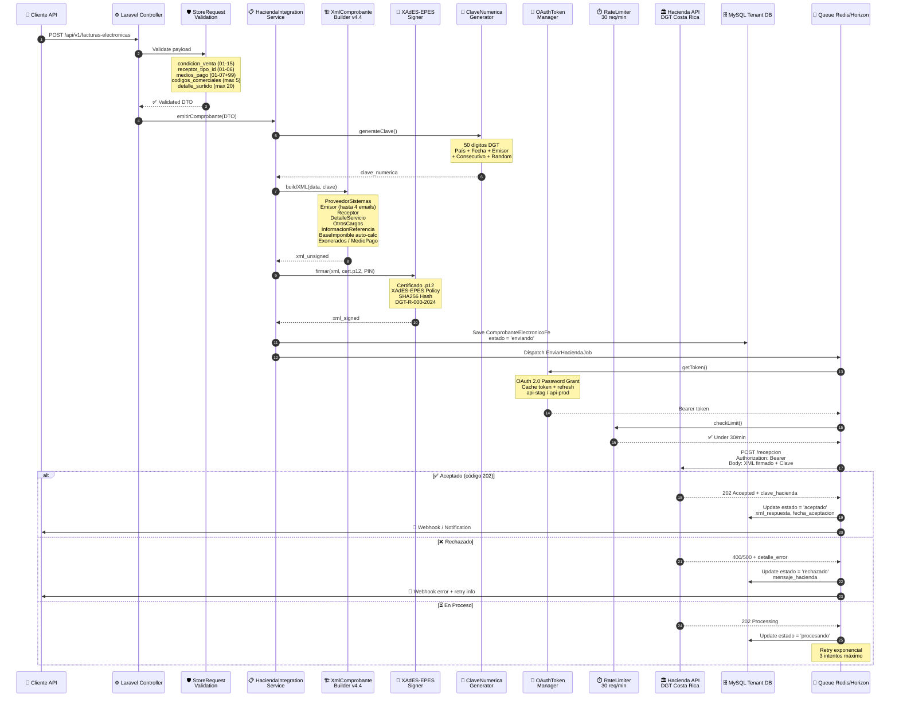

# Flujo de Facturación Electrónica — Hacienda v4.4

> Proceso completo desde el envío de datos del cliente hasta la aceptación/rechazo por Hacienda de Costa Rica (DGT-R-000-2024).

## Diagrama de Secuencia

## Componentes del Flujo

| Paso | Servicio | Descripción |
|------|----------|-------------|
| 1-3 | **StoreRequest** | Validación de 20+ campos según normativa DGT v4.4 |
| 4-5 | **ClaveNumericaGenerator** | Genera clave única de 50 dígitos (país+fecha+emisor+consecutivo+random) |
| 6-7 | **XmlComprobanteBuilder** | Construye XML v4.4 con campos: ProveedorSistemas, OtrosCargos, BaseImponible auto-calc, Exonerados, hasta 5 CodigosComerciales, hasta 20 DetallesSurtido |
| 8-9 | **XAdES-EPES Signer** | Firma digital con certificado .p12, política SHA256 según DGT-R-000-2024 |
| 10 | **DB Save** | Persiste ComprobanteElectronicoFe con estado 'enviando' |
| 11-17 | **Job Async** | OAuth token → Rate limit check → POST a Hacienda → Update estado |

## Compliance Hacienda v4.4

- **38/38 brechas resueltas** (100% compliance)
- **49 tests unitarios** del XML Builder (124 assertions)
- **10 tests E2E** contra sandbox real de Hacienda
- **117+ tests totales** del módulo de facturación
