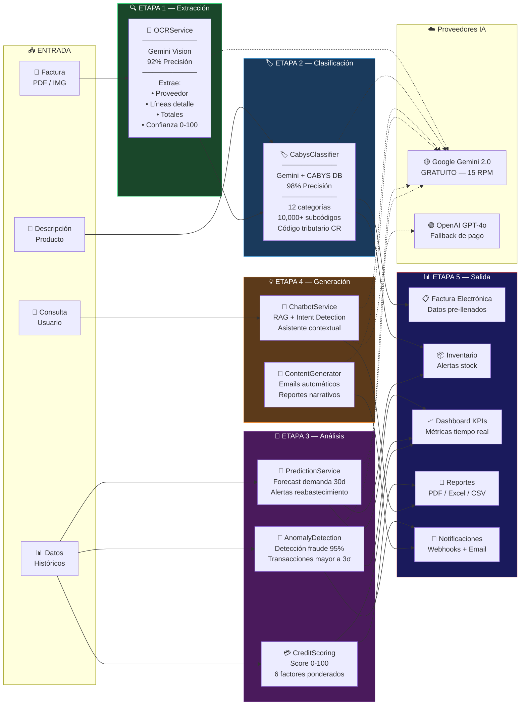

# Ciclo de Vida del Dato con IA — 10 Servicios

> Cómo un archivo físico pasa por OCR, se clasifica automáticamente con CAByS y alimenta el Análisis Financiero y Credit Scoring.

## Diagrama de Flujo Completo



## 10 Servicios de IA — Detalle

| # | Servicio | Provider | Endpoints | Precisión | Descripción |
|---|----------|----------|-----------|-----------|-------------|
| 1 | **GeminiService** | Google Gemini 2.0 Flash | LLM genérico | — | Motor principal, **GRATUITO** |
| 2 | **OpenAIService** | GPT-4o | Fallback + embeddings | — | Alternativa de pago |
| 3 | **OCRService** | Gemini Vision | 3 endpoints | **92%** | Escaneo inteligente de facturas |
| 4 | **ChatbotService** | Gemini 2.0 Flash | 3 endpoints | **90%** | Asistente RAG contextual |
| 5 | **PredictionService** | Gemini + estadística | 6 endpoints | **85%** | Forecast de demanda 30 días |
| 6 | **AnomalyDetectionService** | Gemini + heurísticas | 4 endpoints | **95%** | Detección de fraude y anomalías |
| 7 | **ContentGeneratorService** | Gemini 2.0 Flash | 5 endpoints | — | Emails y reportes automáticos |
| 8 | **CabysClassifierService** | Gemini + CABYS DB | 5 endpoints | **98%** | Clasificación tributaria CR |
| 9 | **CreditScoringService** | Modelo matemático | 6 endpoints | **88%** | Score de crédito 0-100 |
| 10 | **AIServiceInterface** | Contrato | — | — | Interface para todos los servicios |

## Ejemplo: Flujo OCR → CAByS → Factura Electrónica

```
1. 📄 Usuario sube factura PDF del proveedor
2. 🤖 OCRService extrae: proveedor, líneas, totales (confianza: 92%)
3. 🏷️ CabysClassifier asigna código tributario a cada línea (confianza: 98%)
4. 📋 Datos pre-llenan formulario de Compra + generan asiento contable
5. ✅ Factura Electrónica lista para envío a Hacienda
```
