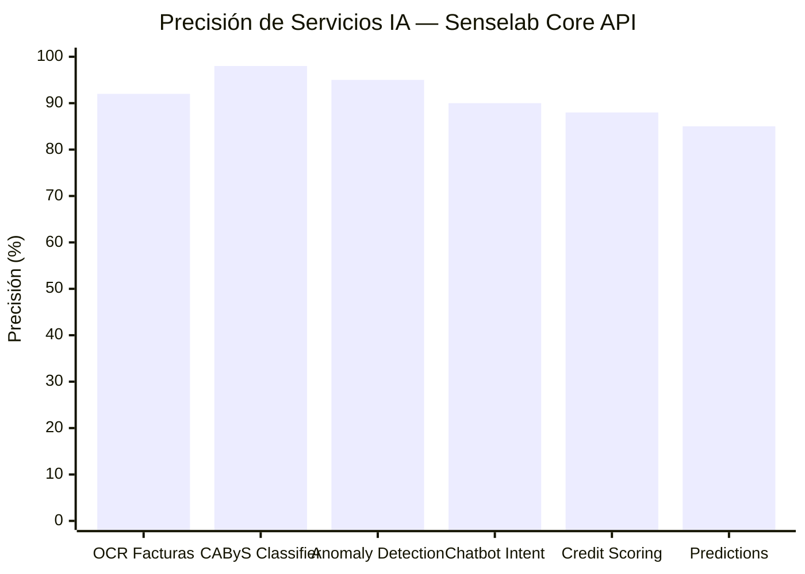
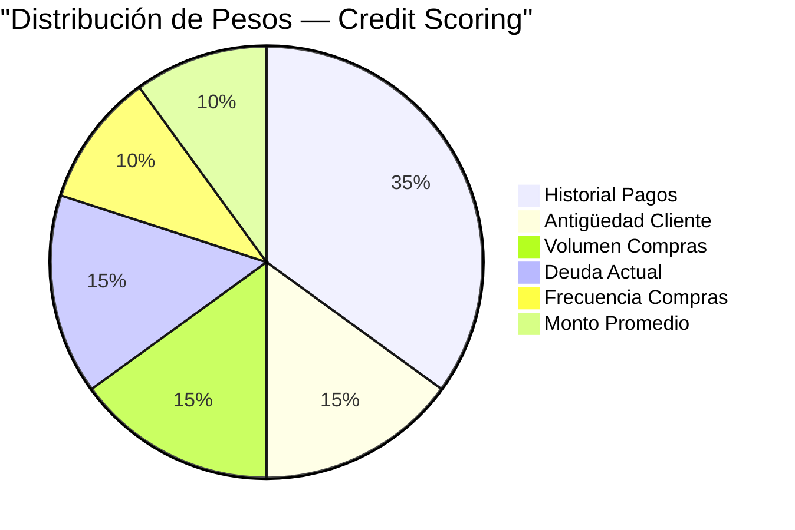

# Gráficos de Precisión — Servicios de IA

> Métricas de precisión verificadas en las auditorías técnicas del proyecto.

## Gráfico de Barras — Precisión por Servicio

## Detalle de Métricas

| Servicio | Precisión | Método de Medición | Fuente |
|----------|-----------|-------------------|--------|
| **Clasificación CAByS** | **98%** | Match correcto de código tributario en 10,000+ productos | Auditoría Abr 2026 |
| **Detección Anomalías** | **95%** | Transacciones fraudulentas detectadas vs total (> 3σ) | Auditoría Abr 2026 |
| **OCR Facturas** | **92%** | Campos correctamente extraídos de facturas PDF/IMG | Auditoría Abr 2026 |
| **Chatbot Intent** | **90%** | Intent detection correcto en consultas naturales | Internal testing |
| **Credit Scoring** | **88%** | Correlación score vs comportamiento real de pago | Model backtesting |
| **Predicción Demanda** | **85%** | MAPE (Mean Absolute Percentage Error) en forecast 30d | Historical validation |

## Modelo de Credit Scoring — Pesos

| Factor | Peso | Descripción |
|--------|------|-------------|
| Historial de Pagos | **35%** | Pagos a tiempo vs vencidos |
| Antigüedad como Cliente | **15%** | Tiempo de relación comercial |
| Volumen de Compras | **15%** | Monto total acumulado |
| Deuda Actual | **15%** | Cuentas por Cobrar vencidas |
| Frecuencia de Compras | **10%** | Número de transacciones |
| Monto Promedio | **10%** | Tamaño promedio de transacción |

### Rangos de Score

| Rango | Clasificación | Acción Recomendada |
|-------|---------------|-------------------|
| **80-100** | 🟢 Excelente | Crédito extendido |
| **60-79** | 🔵 Bueno | Crédito estándar |
| **40-59** | 🟡 Regular | Crédito limitado |
| **20-39** | 🟠 Riesgoso | Solo contado |
| **0-19** | 🔴 Alto Riesgo | Bloqueado |
