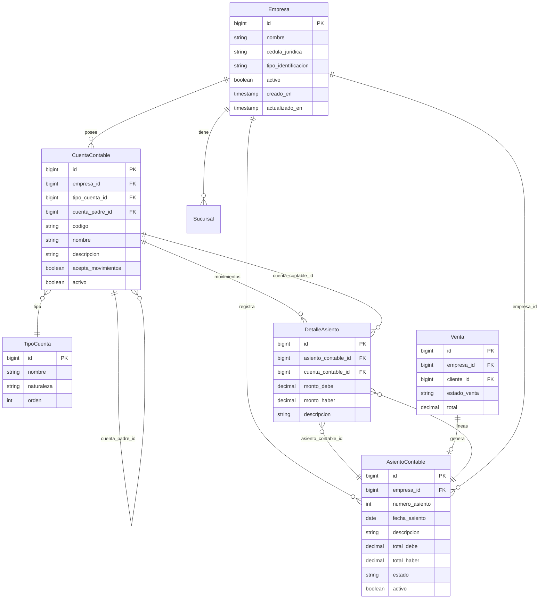

# ERD — Módulo Contable

> Relaciones entre Empresa, Cuentas Contables (jerárquicas), Asientos y sus Detalles.

## Diagrama Entidad-Relación

## Notas de Diseño

- **CuentaContable** tiene relación **auto-referencial** via `cuenta_padre_id` para soportar el árbol jerárquico (ej: Activo → Circulante → Bancos → Banco X)
- **AsientoContable** valida cuadre: `total_debe == total_haber` mediante `estaCuadrado()`
- **DetalleAsiento** es la tabla pivote que conecta cada línea del asiento con su cuenta contable
- **Venta** genera automáticamente un AsientoContable al completarse
- Todos los modelos usan `BelongsToTenant` → filtro automático por `empresa_id`
