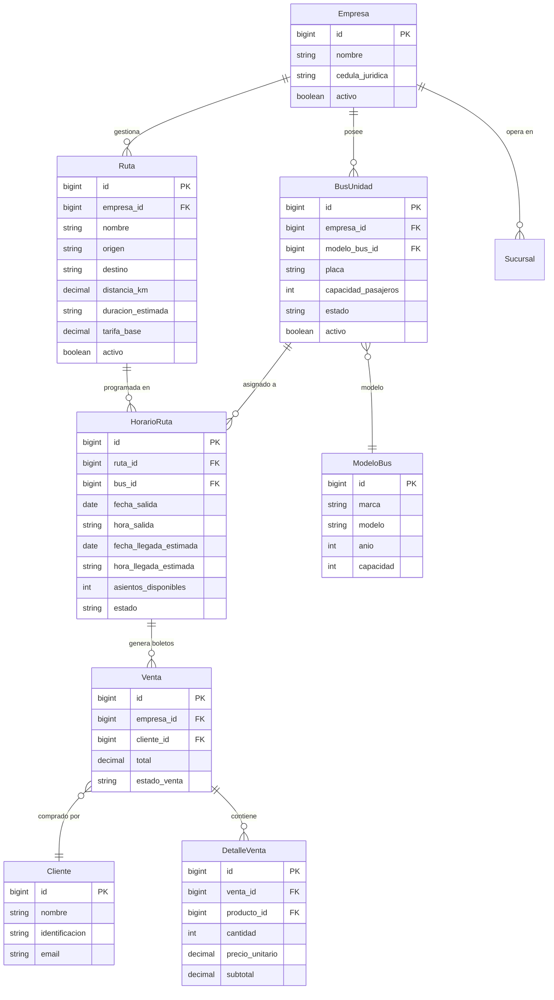

# ERD — Módulo Logística / Transporte

> Relaciones entre Rutas, Horarios, Buses y Venta de Boletos.

## Diagrama Entidad-Relación



## Flujo Operativo

```
1. 🛣️ Empresa define Rutas (origen → destino, tarifa, duración)
2. 🚌 Empresa registra BusUnidades (placa, capacidad, modelo)
3. 📅 Se crean HorariosRuta asignando Bus + Ruta + Fecha/Hora
4. 🎫 Cliente compra Boleto → genera Venta con DetalleVenta
5. 📊 asientos_disponibles se decrementa automáticamente
```
