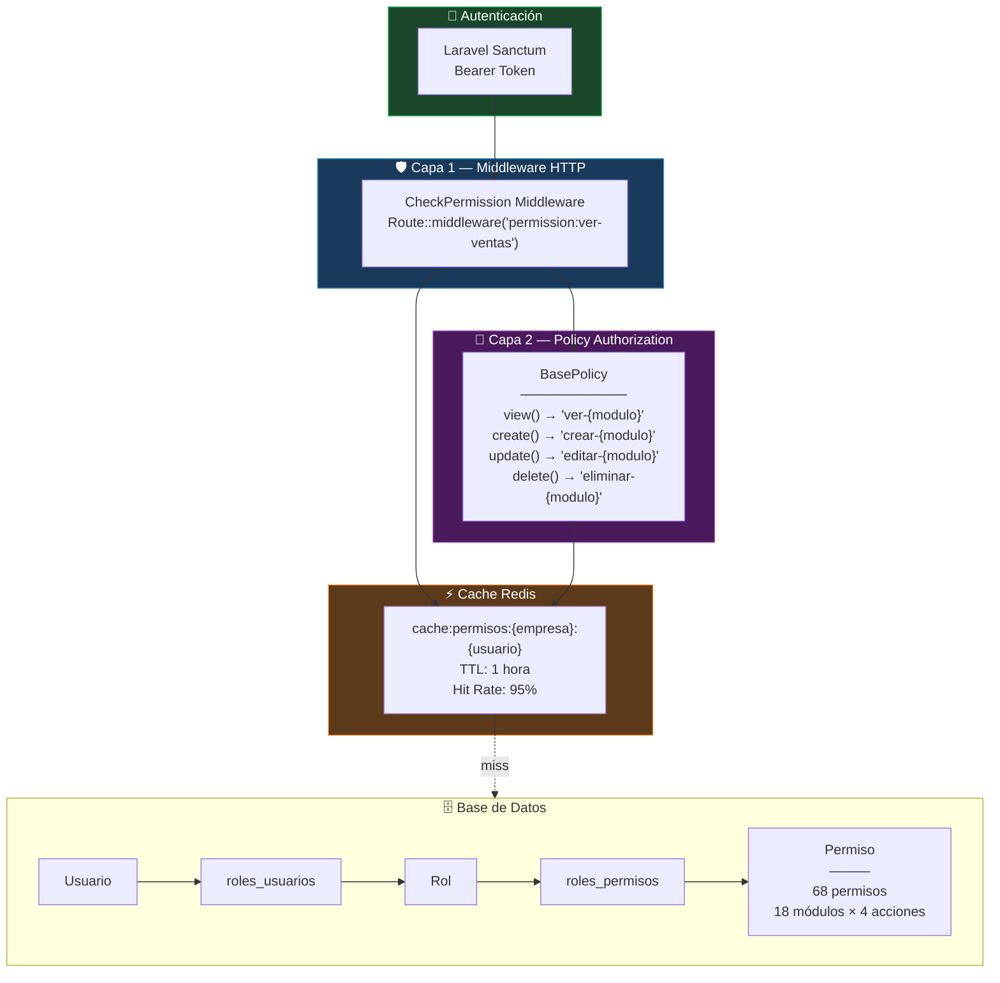

# Matriz de Seguridad RBAC — Control de Acceso

> 68 permisos granulares distribuidos en 8 roles sistémicos y 18 módulos.

## Mapa de Acceso por Rol

```
🟢 = CVED (Crear, Ver, Editar, Eliminar)    🟡 = Solo Ver    🔴 = Sin acceso
```

| Módulo | Super Admin | Administrador | Gerente | Contador | Vendedor | Comprador | Bodeguero | Usuario |
|--------|:-----------:|:-------------:|:-------:|:--------:|:--------:|:---------:|:---------:|:-------:|
| **Empresas** | 🟢 CVED | 🟢 CVED | 🟡 V | 🔴 | 🔴 | 🔴 | 🔴 | 🔴 |
| **Sucursales** | 🟢 CVED | 🟢 CVED | 🟡 V | 🔴 | 🔴 | 🔴 | 🔴 | 🔴 |
| **Usuarios** | 🟢 CVED | 🟢 CVED | 🟡 VE | 🔴 | 🔴 | 🔴 | 🔴 | 🔴 |
| **Roles** | 🟢 CVED | 🟢 CVED | 🟡 V | 🔴 | 🔴 | 🔴 | 🔴 | 🔴 |
| **Productos** | 🟢 CVED | 🟢 CVED | 🟢 CVED | 🟡 V | 🟡 V | 🟡 VE | 🟢 CVED | 🟡 V |
| **Clientes** | 🟢 CVED | 🟢 CVED | 🟢 CVED | 🟡 V | 🟢 CVED | 🔴 | 🔴 | 🟡 V |
| **Proveedores** | 🟢 CVED | 🟢 CVED | 🟢 CVED | 🟡 V | 🔴 | 🟢 CVED | 🟡 V | 🔴 |
| **Inventario** | 🟢 CVED | 🟢 CVED | 🟢 CVED | 🟡 V | 🔴 | 🟡 VE | 🟢 CVED | 🔴 |
| **Ventas** | 🟢 CVED | 🟢 CVED | 🟢 CVED | 🟡 V | 🟢 CVED | 🔴 | 🔴 | 🟡 V |
| **Compras** | 🟢 CVED | 🟢 CVED | 🟢 CVED | 🟡 V | 🔴 | 🟢 CVED | 🟡 V | 🔴 |
| **Contabilidad** | 🟢 CVED | 🟢 CVED | 🟡 V | 🟢 CVED | 🔴 | 🔴 | 🔴 | 🔴 |
| **Nómina** | 🟢 CVED | 🟢 CVED | 🟡 V | 🟢 CVED | 🔴 | 🔴 | 🔴 | 🔴 |
| **Cuentas Cobrar** | 🟢 CVED | 🟢 CVED | 🟡 V | 🟢 CVED | 🟡 V | 🔴 | 🔴 | 🔴 |
| **Cuentas Pagar** | 🟢 CVED | 🟢 CVED | 🟡 V | 🟢 CVED | 🔴 | 🟡 V | 🔴 | 🔴 |
| **Facturación** | 🟢 CVED | 🟢 CVED | 🟡 V | 🟢 CVED | 🟢 CVE | 🔴 | 🔴 | 🔴 |
| **Reportes** | 🟢 CVED | 🟢 CVED | 🟢 CVED | 🟢 CVED | 🟡 V | 🟡 V | 🟡 V | 🟡 V |
| **Configuración** | 🟢 CVED | 🟢 CVED | 🟡 V | 🔴 | 🔴 | 🔴 | 🔴 | 🔴 |
| **Webhooks** | 🟢 CVED | 🟢 CVED | 🟡 V | 🔴 | 🔴 | 🔴 | 🔴 | 🔴 |

## Diagrama de Relaciones RBAC



## Enforcement en Doble Capa

### Capa 1 — Middleware (HTTP Request)
```php
// routes/api/ventas.php
Route::middleware(['auth:sanctum', 'permission:ver-ventas'])
    ->get('/ventas', [VentaController::class, 'index']);
```

### Capa 2 — Policy (Controller/Blade)
```php
// app/Policies/VentaPolicy.php
class VentaPolicy extends BasePolicy {
    protected $permission = 'ventas';
    // Hereda: view→'ver-ventas', create→'crear-ventas', etc.
}
```

### Cache de Permisos
```php
// Cache invalidation vía Observer en RolPermiso
cache:permisos:{empresa_id}:{usuario_id} → Set(68 permisos)
// TTL: 1 hora | Hit rate: 95%
```

## 80 Policies Implementadas

Una Policy por modelo principal, todas extienden `BasePolicy`:

| Categoría | Policies | Módulo |
|-----------|----------|--------|
| **Admin** | EmpresaPolicy, SucursalPolicy, UsuarioPolicy, RolPolicy | Administración |
| **Maestros** | ProductoPolicy, ClientePolicy, ProveedorPolicy, CategoriaPolicy | Catálogos |
| **Operativo** | VentaPolicy, CompraPolicy, InventarioPolicy | Operaciones |
| **Financiero** | ContabilidadPolicy, NominaPolicy, CuentaCobrarPolicy, CuentaPagarPolicy | Finanzas |
| **FE** | ComprobantePolicy, FacturacionPolicy | Hacienda |
| **Sistema** | ReportePolicy, ConfiguracionPolicy, WebhookPolicy | Infraestructura |
