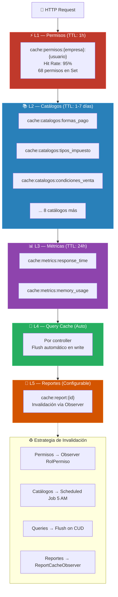
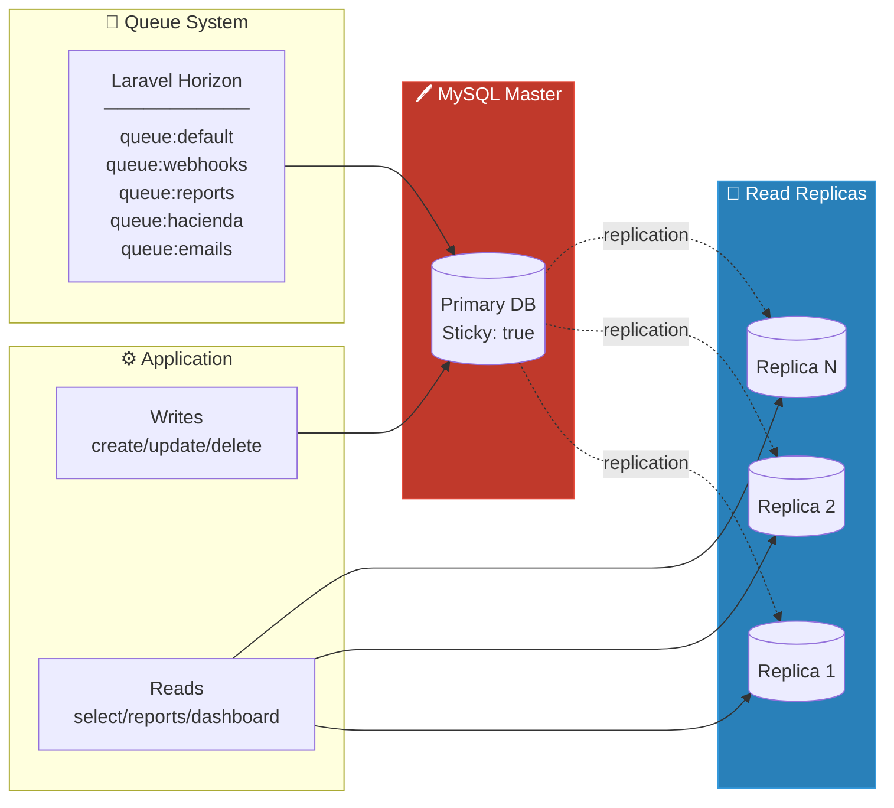

# Benchmarks de Rendimiento — Redis Cache

> Demostración del 90-95% de mejora en latencia gracias a Redis multi-capa.

## Gráfico Comparativo de Latencia

```mermaid
xychart-beta
    title "Latencia: Sin Caché vs Con Redis Cache (ms)"
    x-axis ["Catálogos", "Permisos", "Productos", "Dashboard", "Reportes", "Clientes"]
    y-axis "Latencia (ms)" 0 --> 500
    bar [450, 380, 320, 480, 420, 350]
    bar [28, 12, 35, 45, 50, 22]
```

## Tabla de Resultados

| Endpoint | Sin Caché (ms) | Con Redis (ms) | Mejora | Hit Rate |
|----------|:--------------:|:--------------:|:------:|:--------:|
| **GET /catalogos** | 450 ms | 28 ms | **93.8%** | 99% |
| **Verificar Permisos** | 380 ms | 12 ms | **96.8%** | 95% |
| **GET /productos** | 320 ms | 35 ms | **89.1%** | 85% |
| **GET /dashboard/kpis** | 480 ms | 45 ms | **90.6%** | 80% |
| **GET /reportes** | 420 ms | 50 ms | **88.1%** | Configurable |
| **GET /clientes** | 350 ms | 22 ms | **93.7%** | 90% |
| | | **Promedio** | **~92%** | |

## Arquitectura de Cache Multi-Capa

## Read/Write Split (FASE 22)

## Queues con Laravel Horizon

| Cola | Propósito | Workers | Prioridad |
|------|-----------|---------|-----------|
| `default` | Operaciones generales | 3 | Normal |
| `webhooks` | Event-driven HMAC-SHA256 | 2 | Alta |
| `reports` | Reportes PDF/Excel/CSV | 1 | Baja |
| `hacienda` | OAuth + envío XML a DGT | 2 | Alta |
| `emails` | Notificaciones transaccionales | 2 | Normal |
