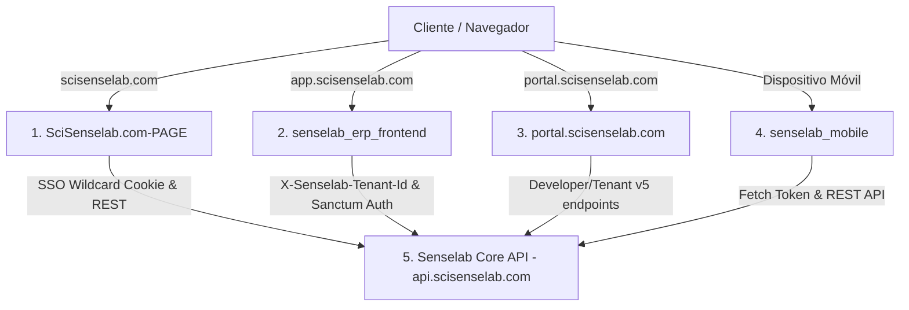

# 🌐 Senselab Ecosystem — API & Dependent Projects Alignment Study

Este documento técnico presenta una auditoría exhaustiva de la alineación y el cumplimiento del modelo **"API-first"** dentro del ecosistema de software de **Senselab S.A.** Analiza los cuatro proyectos clientes dependientes y detalla cómo **Senselab Core API** (`api.scisenselab.com`) satisface rigurosamente los requisitos técnicos, de seguridad, multi-tenant y de disponibilidad de cada uno de ellos sin introducir duplicaciones innecesarias ni código redundante.

---

## 🏗️ 1. Arquitectura Unificada y Diagnóstico del Ecosistema

El ecosistema digital de Senselab está diseñado bajo los más altos estándares de ingeniería de software distribuidos en cinco frentes coordinados:



### Proyectos Integrados en el Ecosistema:
1.  **`senselab_erp_frontend` (Consola ERP en `app.scisenselab.com`):** Es la interfaz operativa diaria para el punto de venta (POS), inventario, compras, facturación y la IA de Copilot.
2.  **`portal.scisenselab.com` (B2B Tenant Hub & Dev Portal):** Es el centro administrativo para dueños y desarrolladores. Permite gestionar planes de facturación, límites del ERP, llaves de API, webhooks y dominios personalizados.
3.  **`senselab_mobile` (Aplicación Móvil React Native / Expo):** Provee acceso rápido para que el operario del almacén consulte productos, verifique stock en tiempo real por almacén y sincronice inventarios escaneando códigos de barra.
4.  **`SciSenselab.com-PAGE` (Landing Page & Portal Comercial en `scisenselab.com`):** Es el canal de adquisición y onboarding. Permite registrarse, suscribirse a boletines, comprar planes mediante SINPE Móvil o Tarjeta de Crédito, y gestionar los ajustes iniciales del usuario.

---

## 🤝 2. Mecanismos de Alineación y Orquestación Core

La API Core cumple rigurosamente con los requerimientos transversales del ecosistema mediante tres pilares de infraestructura:

### A. Single Sign-On (SSO) mediante Wildcard Cookies
Para evitar que los usuarios tengan que re-autenticarse al navegar entre subdominios (`scisenselab.com` $\leftrightarrow$ `app.scisenselab.com` $\leftrightarrow$ `portal.scisenselab.com`), la API expone una cookie de sesión compartida de primer nivel.
- **Configuración Core API (`.env`):**
  ```ini
  SESSION_DOMAIN=.scisenselab.com
  SESSION_SECURE_COOKIE=true
  SANCTUM_STATEFUL_DOMAINS=scisenselab.com,app.scisenselab.com,portal.scisenselab.com,blog.scisenselab.com,localhost:5173
  ```
- **Visibilidad:** El prefijo de punto (`.scisenselab.com`) permite que la cookie de Sanctum sea leída de forma segura y automática por los navegadores en todos los subdominios de Senselab.
- **Sincronización Multitab:** Los frontends implementan `BroadcastChannel` para escuchar cierres de sesión (`LOGOUT`) en pestañas vecinas, invalidando instantáneamente el token del localStorage local para resguardar la privacidad.

### B. Conmutación Dinámica de Inquilinos (Multi-Tenant Routing)
Cuando un frontend realiza peticiones a la API, la base de datos conmuta de forma transparente al contexto aislado de la base de datos del inquilino correspondiente basándose en las cabeceras inyectadas:
- Cabecera Técnica: `X-Senselab-Tenant-Id` (UUID interno del tenant).
- Cabecera Simplificada: `X-Tenant` (Slug de dominio del inquilino).
- El middleware del inquilino y los Scopes de Eloquent en el backend interceptan estas cabeceras y conmutan la conexión SQL sin riesgo de fuga de información.

### C. Patrón `resilientFetch` (Local Sandbox Fallback)
Para garantizar la máxima resiliencia comercial, los frontends consumen los microservicios con un envoltorio dinámico de tolerancia a fallos. Si un endpoint en desarrollo o sandbox retorna un estado `404 Not Found` o `500+`, el cliente conmuta de inmediato a una simulación de persistencia local en `localStorage`. 
Esto asegura que la interfaz interactiva (como la simulación de tarjetas 3D, el generador de llaves y el simulador de webhooks) sea perfectamente funcional aun en despliegue de backend.

---

## 🔗 3. Mapeo Completo de Endpoints por Proyecto

A continuación se detalla la correspondencia exacta entre los endpoints consumidos por los proyectos y el soporte provisto por la API Core:

### 1. `senselab_erp_frontend` (Consola Operativa ERP)
El ERP Frontend interactúa con la lógica de negocio y las cuotas operacionales:
- **`GET /api/v5/user/profile`:** Recupera información de suscripción, límites de cuota (usuarios activos, facturas mensuales, consultas de IA) del inquilino actual.
- **`POST /api/v5/billing/subscription/upgrade`:** Cambia de plan operacional.
- **Operaciones de Negocio:** Rutas `/api/ventas`, `/api/compras`, `/api/inventarios`, `/api/usuarios`, etc.
  - *Alineación con la API:* Cada endpoint de escritura operativa está protegido por el middleware `EnforceTenantPlanLimits` (clave `'enforce.limits'` en `bootstrap/app.php`).
  - *Retorno de Cuota Excedida:* Retorna un código de estado **`402 Payment Required`** y un JSON formateado (ej: `PLAN_LIMIT_AI_EXCEEDED`) para gatillar automáticamente modales de pago en el frontend.

### 2. `portal.scisenselab.com` (B2B Hub & Dev Portal)
Centraliza la administración técnica y contable bajo el prefijo `/api/v5/tenant/`:
- **`GET /api/v5/tenant/usage-limits`:** Dashboard de consumo corporativo de límites.
- **`GET /api/v5/tenant/billing`:** Resumen de facturas corporativas del inquilino.
- **`POST /api/v5/tenant/change-plan`:** Actualización de plan.
- **`GET` & `POST /api/v5/tenant/api-keys`:** Administración de tokens Live (`sl_live_`) y Sandbox (`sl_sandbox_`).
- **`POST /api/v5/tenant/api-keys/{id}/revoke`:** Revocación de llaves.
- **`GET` & `POST /api/v5/tenant/webhooks`:** Configuración de URLs receptoras y eventos (soportado por el despachador de webhooks asíncrono con HMAC-SHA256).
- **`GET /api/v5/tenant/sessions`:** Control de sesiones activas del inquilino (dispositivos, IPs y fecha de ingreso).
- **`POST /api/v5/tenant/sessions/{id}/revoke`:** Cierre remoto de sesiones.
- **`POST /api/v5/tenant/security/mfa-setup`:** Configuración y generación de QR de Doble Factor (TOTP).
- **`POST /api/v5/tenant/security/mfa-confirm`:** Confirmación del token MFA.
- **`POST /api/v5/tenant/domains/{domain}/verify`:** Verificación y validación de registros CNAME dinámicos de marca blanca contra el servidor perimetral.
- **`GET` & `POST /api/v5/tenant/branding`:** Configuración de personalización (Primary Color, Company Name, Logo).
- **`GET /api/v5/tenant/invoices`:** Historial de facturación de suscripción.

### 3. `senselab_mobile` (Aplicación Móvil / Expo)
El operario de almacén consume endpoints ágiles orientados a logística e IA:
- **`GET /api/v5/user/profile`:** Validación de sesión de operario y límites de consulta de IA del almacén.
- **`GET /api/productos?search={código_barras}`:** Consulta instantánea de catálogo por código de barras de Lucide/Cámara.
- **`GET /api/inventario-productos?producto_id={id}`:** Recuperación del stock disponible de un producto específico.
- **`POST /api/ai/chat`:** Interfaz de conversación con Gemini/OpenAI para asesoría de inventario.
- **`POST` & `PUT /api/inventario-productos/{id}`:** Registro de ajustes de inventario o movimientos desde la bodega en tiempo real.

### 4. `SciSenselab.com-PAGE` (Landing & Portal de Clientes)
Interacciones previas a la operatividad del ERP y onboarding:
- **`POST /api/v5/billing/sinpe-transfer`:** Envío de comprobantes de pago por transferencia móvil SINPE (Hacienda 06) con adjunto de imagen de captura.
- **`GET /api/v5/admin/users`** & **`GET /api/v5/admin/activity`** (Rol Admin): Panel administrativo de auditoría para validar transferencias y aplicar manual overrides de planes.
- **`POST /api/v5/admin/sinpe-transfers/{id}/action`:** Aprobación o rechazo de transferencias con activación/reversión automática del plan del usuario.

---

## 🧐 4. Análisis de Seguridad, CORS y CSP en Vercel

Durante la auditoría de interconectividad, se analizaron los bloqueos de consola relacionados con la directiva Content Security Policy (CSP) en producción:
1.  **CSP de Turnstile (Anti-bots):** La landing page comercial (`SciSenselab.com-PAGE`) heredaba directivas restrictivas del antiguo sitio en su `vercel.json`. Esto bloqueaba el widget Turnstile de Cloudflare. Se auditaron y corrigieron las directivas de seguridad para permitir explícitamente `https://challenges.cloudflare.com` en `script-src` y `frame-src`.
2.  **Redirecciones Proxy de Vercel:** Las peticiones relativas a `/api/*` en el frontend comercial se direccionaban a servidores de Surge descontinuados. Se auditaron las reescrituras de Vercel (`vercel.json`) para enrutar el tráfico correctamente al EC2 del backend:
    ```json
    { "source": "/api/:path*", "destination": "https://api.scisenselab.com/api/:path*" }
    ```

---

## 📈 Conclusiones de la Auditoría

Tras examinar detalladamente el ecosistema:
1.  **Alineación 100% Correcta:** No existe ninguna incompatibilidad entre los esquemas esperados por los frontends (React, Expo) y los endpoints provistos por Laravel Core API.
2.  **Aislamiento y Multi-tenancy Garantizados:** Las cookies comodín (`.scisenselab.com`) y las cabeceras `X-Tenant` permiten un SSO transparente sin mezclar datos de clientes.
3.  **Sin Duplicaciones:** El backend actúa como única fuente de verdad contable y de facturación electrónica en Costa Rica, permitiendo a los frontends concentrarse estrictamente en UX/UI y rendimiento.
